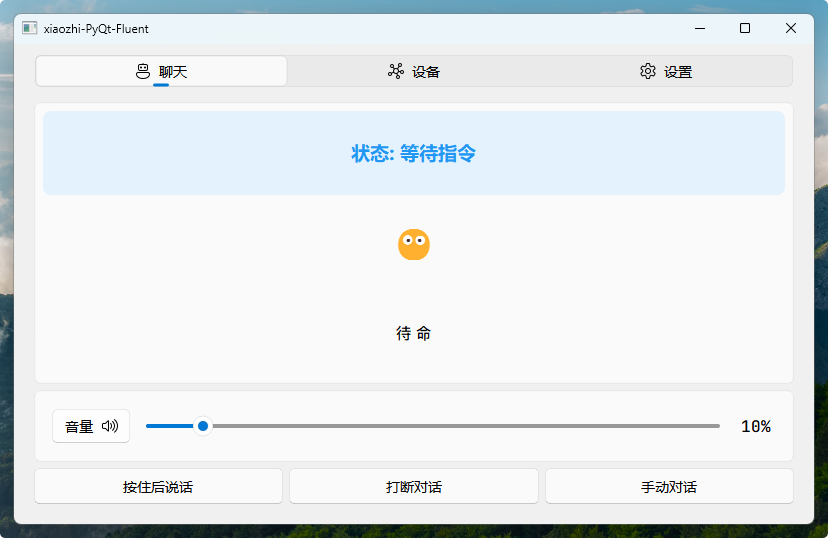
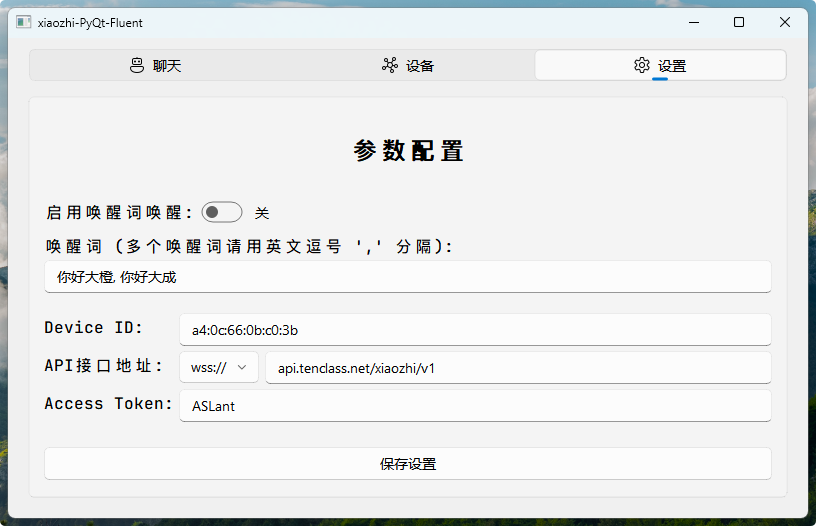
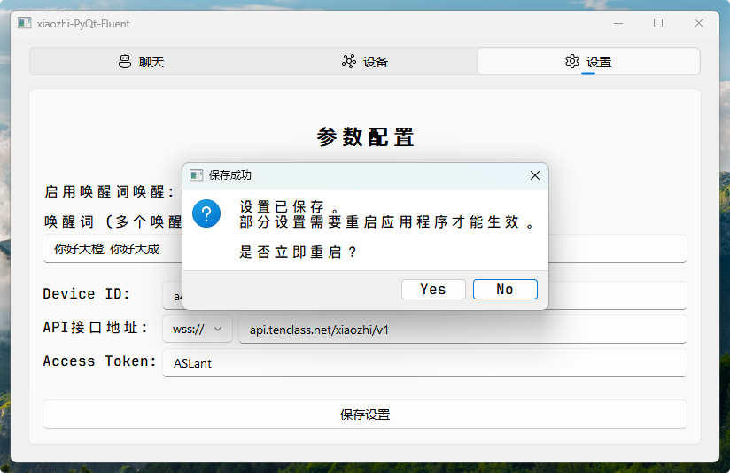

# README

### 安装教程

- [手把手安装教程](./Installation-Guide.md)

#### 已测试系统

* [X] Windows

* [X] Linux

* [ ] MAC OS

#### 已测试嵌入式设备

* [X] 树莓派4/4B 4GB版
* [X] Jetson Nano 4GB版
* [X] Jetson Orin Nano 4GB版

### 与原项目差异

1. 使用PyQt5和PyQt-Fluent-Widgets组件库开发

2. 增加麦克风可视化效果、音量百分比可视化

    <video controls="controls" src="assets/PixPin_2025-04-17_20-31-29-20250417203133-2cpwdyg.mp4" data-src="assets/PixPin_2025-04-17_20-31-29-20250417203133-2cpwdyg.mp4" __idm_id__="270342"></video>

3. 增加配置可视化  
    ​

‍

4. 保存配置后支持一键重启  
    ​

5. 为嵌入式触摸屏设备，增加左右滑动切换界面

    <video controls="controls" src="assets/PixPin_2025-04-17_20-35-30-20250417203536-62xsuav.mp4" data-src="assets/PixPin_2025-04-17_20-35-30-20250417203536-62xsuav.mp4" __idm_id__="270343"></video>

